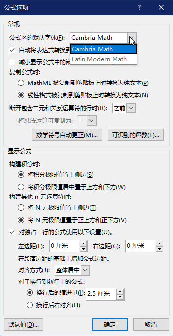
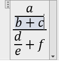
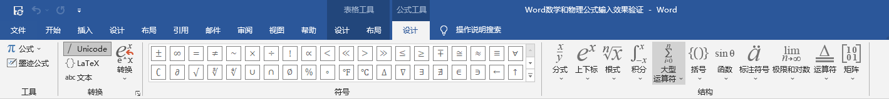
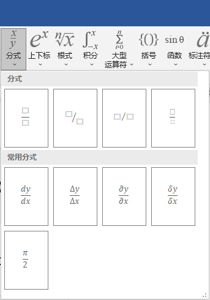
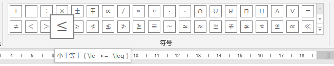
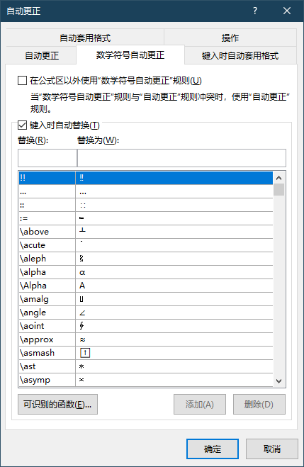

# 准备和输入

本章将讲解UnicodeMath的准备和输入方式。

## 准备

为了我们可以更顺利地输入并获得我们想要的公式，我们要做一些准备。

**在英文输入法的条件下输入公式**。

word曾经有一个“feature”，就是在非英文输入法的状态下，输入的公式不会自动倾斜，在中文输入法的英文状态下也不行。虽然我用的2019版没再见过这个“特性”，但是之前的版本还是可能会遇到这个情况。

**取消word的“自动更正”选项卡中的“直引号替换为弯引号”**。

word对输入的内容有自动更正的功能，比如将两个连字符“--”变成长划线“——”。直引号在word的UnicodeMath输入中有自己的作用，若让word“自作聪明”地修改为弯引号，会导致相关功能失效。修改方式：文件→选项→校对→自动更正选项→自动更正选项…→键入时自动套用格式→直引号替换为弯引号。

**公式的字体请从文档输入第一个公式开始就要设定**。

word公式默认的字体是Cambria Math，有人不喜欢这个字体，word也可以更换。但是若中途更换公式的字体，那么字体只会从当前公式开始生效，之前输入的公式会保留之前的字体。

要设置公式的字体，要先选择一个公式区，在上方出现的“公式工具”选项卡中再选择“转换”标签的右下角，会跳出“公式选项”的设置窗口。在“公式区的默认字体”之后再选择字体就可以设置当前和之后的公式区的字体了。



如果需要使用word预装之外的其他字体，那就要先安装需要的字体，然后重启word，和上面一样打开“公式选项”，就可以在字体选项中看到新安装的字体。

**记住相关的快捷键可以提高输入的效率**。

- 按快捷键“Alt”+“=”插入公式；
- 按快捷键“Ctrl”+“=”转换公式为“专业”；
- 按快捷键“Ctrl”+“z”撤回输入的内容。

## 转换

首先稍微讲一下UnicodeMath的工作方式。UnicodeMath其实和LaTeX有点类似，都是输入一个线性文本，定义了公式的部件和结构，然后输出为公式。只是UnicodeMath要先将类似LaTeX的控制词转换成Unicode字符，最后输出为公式。虽然听起来有些抽象，但是之后就会理解这个概念。

### 插入公式

如何在word里插入公式。最直接的方式就是通过选项卡命令“插入”→“符号”→“公式”，就可以在光标的位置处插入数学公式。快捷键“Alt”+“=”也能插入公式。

在使用了上述命令之后，在光标处会出现一个区域，里面有文本“在此键入公式”，这个区域就叫公式区。我们在公式区里输入的内容就会以数学的样式来显示，比如数字是正体，字母是斜体。


当我们选中公式区之后，整个公式的背景会是灰色。而我们点击选中公式的某一处之后，这一部分所处的公式部件的背景会变成更深的灰色。



数字、字母和一些运算符（+、-、=等）我们可以直接从键盘键入，但是这远远不能满足我们的需求。

### “公式工具”选项卡

在插入了公式之后，word窗口上方也会出现一个“公式工具”—“设计”的选项卡，我们可以使用选项卡里的功能来辅助我们输入公式。



选项卡分四部分。首先是“工具”，这部分有两个按钮——“公式”和“墨迹公式”。“公式”里是众多自带的常用公式，点击就可输入。而且以后我们保存自定义公式也是在这里。“墨迹公式”就是windows自带了“数学输入面板”，可以用它来识别手写的公式，并且可以直接插入word中。

其次是“转换”，这部分分为两列，左边一列是“Unicode”、“LaTeX”和“文本”，用来设定当前公式区的公式类型。我们的主题是“UnicodeMath方式输入数学公式”，所以我们在这里要选定“Unicode”按钮。右边一列是“转换”，用来让“当前”或“全部”的公式在“线性”和“专业”之间进行切换。右下角有一个箭头，点击就是打开“公式选项”，可以进行公式相关的设置。

另外两部分是“符号”和“结构”，我们可以点击它们的部件来输入公式的符号和结构。

点击符号中的部件，直接输入符号。默认的是“基础数学”分类的符号，包含了常见的数学符号。点击下拉按钮，在打开的标签的右上角也有一个下拉按钮，点击就可以打开不同分类的数学符号。


点击结构中的部件，则会出现相应的结构形式。结构的组成部分由一个个虚线的方框表示的占位符组成，点击之后就可以继续输入，不仅可以输入字母数字和符号，再点击一个结构类型就可以输入结构到其中。



word的“所见即所得”的特性可以让我们直观地看到公式的效果，但是一是这样点击输入有些麻烦，二是有些功能没在选项卡中提供。所以我们用到UnicodeMath这种方式。

### 行间公式和行内公式

公式区所在的位置不同，会让公式有行内公式和行间公式两种排版方式。如果与文字混排，那就是行内公式；如果单独为一行，则就是行间公式，公式区会自动居中。

一些公式在这两种方式会有不同的外观。以求和符Σ为例。在行间公式中，因为空间不受限制，所以求和符的极限值会在求和符的正上方和正下方；如果是行内公式，为了和文字相适应，运算符会变小，极限值会转移到求和符的侧边，在视觉上显得“局促”。


对于上述的情况，word会自动根据当前公式的类型来调整外观。当然我们也可以对此进行手动设置。

### 数学符号和自动更正

LaTeX用控制词的方式来解决这个问题，例如输入`\alpha`我们就可以得到希腊字母α。UnicodeMath也使用这种方式来达到相同目的。但是在UnicodeMath中，直接保留控制词不能得到对应的符号，要将其转换为对应的Unicode字符，就要在控制词之后再输入空格，就可以转换为对应字符，这样才能在公式中显示。


对于表示公式结构的控制词，UnicodeMath也会将其转换为对应的Unicode字符，其中的一部分字符会在建立的公式中显示，例如大型运算符，另一部分则会在公式建立后消失。

我们将鼠标放在“公式工具”选项卡下的符号上，符号旁会浮现出符号的名称，大部分的符号还会浮现代表该字符的控制词。



**注意**：建议在输入符号的控制词之后就按下空格，将控制词转换为对应的Unicode字符。虽然在我们接着输入一些运算符时，这些控制词也会自动转换，但是一部分符号在样式上会和期望的结果有区别，例如后面会提到的希腊字母。

我们可以用这个方式输入大部分的字符，在“公式选项”下的“数学符号自动更正”里，我们可以查看所有支持的符号。对于不支持的符号，我们可以在这里自行添加。“替换”下输入要设定的控制词，“替换为”下输入要设定的符号。



### 空格的作用

空格的另一种作用是将已输入的线性文本建立为公式。如下图所示，即使没输入公式的部分参数，用空格也能建立。


数学公式的一些括号的高度要跟随其包含的内容，而括号后输入空格可以让括号的高度自动调整。


空格还用来分隔公式的不同部分，像`a_1 b_2`里的空格分隔出了表达式的两个部分，得到$a_1b_2$而不是$a_{1b_2}$。

空格在UnicodeMath中很常用，所以之后的内容将用⎵来表示。

### 可识别函数的介绍

对于函数，我们可以用像“\sin”这种形式去输入，也可以直接用“sin⎵”。这种方式仅限于常用的函数。我们可以在公式选项的“可识别的函数”里查看支持的函数，也可以在这里添加我们想要的函数。

### 转换选项（专业和线性）的介绍

UnicodeMath是将一串线性文本转换为公式，我们可以在“公式工具”选项卡里选择“转换”→“当前-专业(C)”来转换当前线性文本。


这个选项不止如此，还可以将当前已建立的公式转换为线性格式。除了转换当前的公式，我们还可以转换整个文档的所有公式。不过如果这个文档公式太多，转换全部公式容易卡顿，请谨慎使用。

不止选项卡，选定的公式区的最右边有一个下拉箭头，点击后其中也有同样的转换功能选项，还有其他的快捷功能，例如

- 将当前公式另存为新公式，之后我们可以用“公式工具”选项卡里的公式快速输入公式
- 将当前公式在行内公式和行间公式之间进行切换（word里成为“内嵌”和“显示”）
- 修改当前公式的对齐方式


### 从其他输入方式转换为公式

无意中发现了一种用法。首先在一些公式输入工具的网站，例如[LaTeXlive](http://www.LaTeXlive.com)，用LaTeX表达式输入公式之后，输出区域会出现目标公式，再点击下方的**MathML**按钮，就会复制这个公式的MathML代码，最后粘贴到word文档里的公式输入框（此时只能用“只保留文本”的方式粘贴），公式就输入到word中。此类网站不少，甚至还有像[myscript](https://webdemo.myscript.com/views/math/index.html)这样的网站通过手写识别的方式输入公式。

windows自带的“数学输入面板”也有识别手写公式的功能，而且可以直接插入word里。这个功能也整合到了word中，就是“公式工具”下的“墨迹公式”。

不过这种方法还是有出错的可能。就像我尝试用这种方式输入麦克斯韦方程组的微分形式。

LaTeX代码：

```LaTeX
\begin{array}{l}  
  \nabla \cdot \mathbf{E} =\cfrac{\rho}{\varepsilon _0}  \\  
  \nabla \cdot \mathbf{B} = 0 \\  
  \nabla \times  \mathbf{E} = -\cfrac{\partial \mathbf{B}}{\partial t }  \\  
  \nabla \times  \mathbf{B} = \mu_0\mathbf{J} + \mu _0\varepsilon_0 \cfrac{\partial \mathbf{E}}{\partial t }
\end{array}
```

输出的公式：

$$
\begin{array}{l}  
  \nabla \cdot \mathbf{E} =\cfrac{\rho}{\varepsilon _0}  \\  
  \nabla \cdot \mathbf{B} = 0 \\  
  \nabla \times  \mathbf{E} = -\cfrac{\partial \mathbf{B}}{\partial t }  \\  
  \nabla \times  \mathbf{B} = \mu_0\mathbf{J} + \mu _0\varepsilon_0 \cfrac{\partial \mathbf{E}}{\partial t }
\end{array}
$$

结果在word中的显示就成了下图这个样子，原因是上述公式中使用的是`\cfrac`控制词，换成`\frac`后就正常。


