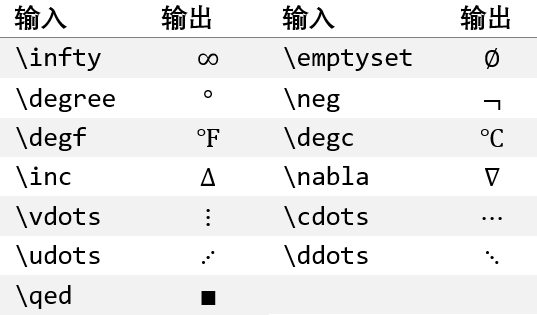

# 符号

如何将控制词转换为相对应的符号，上一章已经了解过了。本章将按照word里的符号的分类和排序讲解UnicodeMath的数学符号输入方式。

虽然UnicodeMath的官方文档中提供了大部分符号的输入控制词，但是也有相当一部分支持的字符未收录其中。其实相当一部分符号的控制词还是直接从LaTeX里搬运过来。

## 基础数学

该分类是将常用的符号都放置到这里，除了部分符号外，其余的都在其他分类里。

输入|输出|输入|输出
---|---|---|---
`\infty`|$\infty$|`\emptyset`|$\emptyset$
`\degree`|$\degree$|`\neg`|$\neg$
`\degf`|$\degree \text{F}$|`\degc`|$\degree \text{C}$
`\inc`|$\Delta$|`\nabla`|$\nabla$
`\vdots`|$\vdots$|`\cdots`|$\cdots$
`\rddots`|$\udots$|`\ddots`|$\ddots$
`\qed`|$\blacksquare$||

## 希腊字母

### 小写

输入|输出|输入|输出
---|---|---|---
`\alpha`|$\alpha$|`\beta`|$\beta$
`\gamma`|$\gamma$|`\delta`|$\delta$
`\epsilon`|$\epsilon$|`\zeta`|$\zeta$
`\eta`|$\eta$|`\theta`|$\theta$
`\iota`|$\iota$|`\kappa`|$\kappa$
`\lambda`|$\lambda$|`\mu`|$\mu$
`\nu`|$\nu$|`\xi`|$\xi$
`\o`|$\omicron$|`\pi`|$\pi$
`\rho`|$\rho$|`\sigma`|$\sigma$
`\tau`|$\tau$|`\upsilon`|$\upsilon$
`\phi`|$\phi$|`\chi`|$\chi$
`\psi`|$\psi$|`\omega`|$\omega$
`\varepsilon`|$\varepsilon$|`\vartheta`|$\vartheta$
`\varpi`|$\varpi$|`\varrho`|$\varrho$
`\varphi`|$\varphi$||

### 大写

输入|输出|输入|输出
---|---|---|---
`\Alpha`|$\Alpha$|`\Beta`|$\Beta$
`\Gamma`|$\Gamma$|`\Delta`|$\Delta$
`\Epsilon`|$\Epsilon$|`\Zeta`|$\Zeta$
`\Eta`|$\Eta$|`\Theta`|$\Theta$
`\Iota`|$\Iota$|`\Kappa`|$\Kappa$
`\Lambda`|$\Lambda$|`\Mu`|$\Mu$
`\Nu`|$\Nu$|`\Xi`|$\Xi$
`\O`|$\Omicron$|`\Pi`|$\Pi$
`\Rho`|$\Rho$|`\Sigma`|$\Sigma$
`\Tau`|$\Tau$|`\Upsilon`|$\Upsilon$
`\Phi`|$\Phi$|`\Chi`|$\Chi$
`\Psi`|$\Psi$|`\Omega`|$\Omega$

希腊字母的输入方法和LaTeX大致相同，都是“\”+“名称”的形式。其对应的大写字母就是首字母转换成大写即可。例如α的大写字母Α由`\Alpha`获得。

还有5个字母有变量形式，只需要在名称前加上`var`就可以。例如`\varsigma`可得到ς。

有一点不同的就是字母ο（omicron）。在LaTeX中用`\omicron`获得，而在UnicodeMath中要用`\o`输入，输入对应的大写字母为`\O`。

在OneNote中输入希腊字母会遇到一个问题。如果希腊字母的控制词不是通过空格转换，就不会以斜体的样式显示。所以推荐在输入希腊字母的控制词之后就按下空格转换。

## 字母类符号

输入|输出|输入|输出
---|---|---|---
`\forall`|$\forall$|`\complement`|$\complement$
`\partial`|$\partial$|`\hbar`|$\hbar$
`\imath`|$\imath$|`\jmath`|$\jmath$
`\frakturI`或`\Im`|$\Im$|`\scriptl`或`\ell`|$\ell$
`\doubleN`|$\mathbb{N}$|`\doubleQ`|$\mathbb{Q}$
`\doubleR`|$\mathbb{R}$|`\doubleZ`|$\mathbb{Z}$
`\exists`|$\exists$|`/\exists`|$\nexists$
`\aleph`|$\aleph$|`\bet`或`\beth`|$\beth$
`\gimel`|$\gimel$|`\dalet`或`\daleth`|$\daleth$

## 运算符

### 常用二元运算符和关系运算符

输入|输出|输入|输出
---|---|---|---
`\times`|$\times$|`\div`|$\div$
`\pm`或`+-`|$\pm$|`\mp`或`-+`|$\mp$
`\propto`|$\propto$|`\ldiv`或`\ldivide`|$/$
`\ast`|$\ast$|`\circ`|$\circ$
`\bullet`|$\bullet$|`\cdot`|$\cdot$
`\cap`|$\cap$|`\cup`|$\cup$
`\sqcap`|$\sqcap$|`\sqcup`|$\sqcup$
`\wedge`|$\wedge$|`\vee`|$\vee$
`\uplus`|$\uplus$|`\ne`或`\neq`|$\neq$
`<=`或`\le`或`\leq`|$\leq$|`>=`或`\ge`或`\geq`|$\geq$
`\equiv`|$\equiv$|`/\equiv`|$\not\equiv$
`\sim`|$\sim$|`\simeq`|$\simeq$
`~~`或`\approx`|$\approx$|`~=`或`\cong`|$\cong$
`\<<`或`\ll`|$\ll$|`>>`或`\gg`|$\gg$
`\in`|$\in$|`\ni`|$\ni$
`\notelement`或`\notin`|$\notin$||
`\subset`|$\subset$|`\supset`|$\supset$
`\subseteq`|$\subseteq$|`\supseteq`|$\supseteq$
`\prec`|$\prec$|`\succ`|$\succ$
`\preceq`|$\preceq$|`\succeq`|$\succeq$
`\sqsubset`|$\sqsubset$|`\sqsupset`|$\sqsupset$
`\sqsubseteq`|$\sqsubseteq$|`\sqsuperseteq`|$\sqsupseteq$
`\parallel`|$\parallel$|`\perp`或`\bot`|$\bot$
`\vdash`|$\vdash$|`\dashv`|$\dashv$
`\bowtie`|$\bowtie$|`\asymp`|$\asymp$

部分运算符可以不用控制词，而是用相关的字符组成。

输入字符|运算符|Unicode
---|---|---
`!!`|‼|`U+203C`
`+-`|±|`U+00B1`
`~~`|≈|`U+2248`
`-+`|∓|`U+2213`
`::`|∷|`U+2237`
`:=`|≔|`U+2254`
`<=`|≤|`U+2264`
`>=`|≥|`U+2265`
`<<`|≪|`U+226A`
`>>`|≫|`U+226B`
`~=`|≅|`U+2245`

### 大型运算符

Ofiice里称为N元运算符。

输入|输出|输入|输出
---|---|---|---
`\int`|$\int$|`\iint`|$\iint$
`\iiint`|$\iiint$|`\iiiint`|$\iiiint$
`\oint`|$\oint$|`\oiint`|$\oiint$
`\oiiint`|$\oiiint$|`\sum`|$\sum$
`\coint`|$\lcirclerightint$|`\aoint`|$\rcirclerightint$
`\prod`|$\prod$|`\coprod`或`\amalg`|$\amalg$
`\bigcap`|$\bigcap$|`\bigcup`|$\bigcup$
`\bigwedge`|$\bigwedge$|`\bigvee`|$\bigvee$
`\bigodot`|$\bigodot$|`\bigotimes`|$\bigotimes$
`\bigoplus`|$\bigoplus$|`\biguplus`|$\biguplus$

### 高级二元运算符

输入|输出|输入|输出
---|---|---|---
`\dotplus`|$\dotplus$|`\dotminus`|$\dotminus$
`\setminus`|$\setminus$|`\divideontimes`|$\divideontimes$
`\boxplus`|$\boxplus$|`\boxminus`|$\boxminus$
`\boxtimes`|$\boxtimes$|`\boxdot`|$\boxdot$
`\ltimes`|$\ltimes$|`\rtimes`|$\rtimes$
`\leftthreetimes`|$\leftthreetimes$|`\rightthreetimes`|$\rightthreetimes$
`\curlyvee`|$\curlyvee$|`\curlywedge`|$\curlywedge$
`\oplus`|$\oplus$|`\ominus`|$\ominus$
`\otimes`|$\otimes$|`\ndiv`|$\oslash$
`\odot`|$\odot$|`\oast`|$\oast$
`\ocirc`|$\circledcirc$|`\intercal`|$\intercal$
`\dag`|$\dag$|`\ddag`|$\ddag$
`\star`|$\star$|`\diamond`|$\diamond$
`\wr`|$\wr$|`\triangle`|$\triangle$
`\bigwedge`|$\bigwedge$|`\bigvee`|$\bigvee$
`\bigoplus`|$\bigoplus$|`\bigotimes`|$\bigotimes$
`\bigodot`|$\bigodot$|`\bigsqcap`|$\bigsqcap$
`\bigsqcup`|$\bigsqcup$|`\biguplus`|$\biguplus$

### 高级关系运算符

输入|输出|输入|输出
---|---|---|---
`therefore`|$\therefore$|`\because`|$\because$
`\lll`|$\lll$|`\ggg`|$\ggg$
`leqq`|$\leqq$|`\geqq`|$\geqq$
`\lesssim`|$\lesssim$|`\gtrsim`|$\gtrsim$
`lessdot`|$\lessdot$|`\gtrdot`|$\gtrdot$
`\lessgtr`|$\lessgtr$|`\gtreqless`|$\gtreqless$
`gtrless`|$\gtrless$|`\gtreqless`|$\gtreqless$
`\Doteq`|$\Doteq$|`\fallingdotseq`|$\fallingdotseq$
`risingdotseq`|$\risingdotseq$|`\backsim`|$\backsim$
`\approxeq`|$\approxeq$|`\backsimeq`|$\backsimeq$
`preceq`|$\preceq$|`\succeq`|$\succeq$
`\curlyeqprec`|$\curlyeqprec$|`\curlyeqsucc`|$\curlyeqsucc$
`precsim`|$\precsim$|`\succsim`|$\succsim$
`\eqless`|$\eqless$|`\eqgtr`|$\eqgtr$
`subseteq`|$\subseteq$|`\supseteq`|$\supseteq$
`\vartriangleleft`|$\vartriangleleft$|`\vartriangleright`|$\vartriangleright$
`trianglelefteq`|$\trianglelefteq$|`\trianglerighteq`|$\trianglerighteq$
`\models`|$\models$|`\propto`|$\propto$
`Subset`|$\Subset$|`\Supset`|$\Supset$
`\sqsubset`|$\sqsubset$|`\sqsupset`|$\sqsupset$
`Vdash`|$\Vdash$|`\Vvdash`|$\Vvdash$
`\eqcirc`|$\eqcirc$|`\circeq`|$\circeq$
`bumpeq`|$\bumpeq$|`\Bumpeq`|$\Bumpeq$
`\between`|$\between$|`\pitchfork`|$\pitchfork$
`doteq`|$\doteq$|`\bowtie`|$\bowtie$||||

## 箭头

输入|输出|输入|输出
---|---|---|---
`\leftarrow`或`\gets`|$\leftarrow$|`\rightarrow`或`->`或`\to`|$\rightarrow$
`\Leftarrow`|$\Leftarrow$|`\Rightarrow`|$\Rightarrow$
`\uparrow`|$\uparrow$|`\downarrow`|$\downarrow$
`\Uparrow`|$\Uparrow$|`\Downarrow`|$\Downarrow$
`\leftrightarrow`|$\leftrightarrow$|`\updownarrow`|$\updownarrow$
`\Leftrightarrow`|$\Leftrightarrow$|`\Updownarrow`|$\Updownarrow$
`\longleftarrow`|$\longleftarrow$|`\longrightarrow`|$\longrightarrow$
`\Longleftarrow`|$\Longleftarrow$|`\Longrightarrow`|$\Longrightarrow$
`\longleftrightarrow`|$\longleftrightarrow$|`\Longleftrightarrow`|$\Longleftrightarrow$
`\dashleftarrow`|$\dashleftarrow$|`\dashrightarrow`|$\dashrightarrow$
`\nearrow`|$\nearrow$|`\nwarrow`|$\nwarrow$|`\searrow`|$\searrow$|`\swarrow`|$\swarrow$
`\nleftarrow`|$\nleftarrow$|`\nrightarrow`|$\nrightarrow$|`\nLeftarrow`|$\nLeftarrow$|`\nRightarrow`|$\nRightarrow$
`\nleftrightarrow`|$\nleftrightarrow$|`\nLeftrightarrow`|$\nLeftrightarrow$|`\hookleftarrow`|$\hookleftarrow$|`\hookrightarrow`|$\hookrightarrow$
`\mapsfrom`（不可用）|$\mapsfrom$|`\mapsto`|$\mapsto$|`\longmapsfrom`（不可用）|$\longmapsfrom$|`\longmapsto`|$\longmapsto$
`\leftharpoonup`|$\leftharpoonup$|`\leftharpoondown`|$\leftharpoondown$|`\rightharpoonup`|$\rightharpoonup$|`\rightharpoondown`|$\rightharpoondown$
`\upharpoonleft`|$\upharpoonleft$|`\upharpoonright`|$\upharpoonright$|`\downharpoonleft`|$\downharpoonleft$|`\downharpoonright`|$\downharpoonright$
`\leftrightharpoons`|$\leftrightharpoons$|`\rightleftharpoons`|$\rightleftharpoons$||||
`\leftleftarrows`|$\leftleftarrows$|`\rightrightarrows`|$\rightrightarrows$|`\upuparrows`|$\upuparrows$|`\downdownarrows`|$\downdownarrows$
`\leftrightarrows`|$\leftrightarrows$|`\rightleftarrows`|$\rightleftarrows$|`\looparrowleft`|$\looparrowleft$|`\looparrowright`|$\looparrowright$
`\leftarrowtail`|$\leftarrowtail$|`\rightarrowtail`|$\rightarrowtail$|`\Lleftarrow`|$\Lleftarrow$|`\Rrightarrow`|$\Rrightarrow$
`\Lsh`|$\Lsh$|`\Rsh`|$\Rsh$|`\ldsh`|$\Ldsh$|`\rdsh`|$\Rdsh$
`\twoheadleftarrow`|$\twoheadleftarrow$|`\twoheadrightarrow`|$\twoheadrightarrow$|`\upuparrows`|$\upuparrows$|`\downdownarrows`|$\downdownarrows$
`\curvearrowleft`|$\curvearrowleft$|`\curvearrowright`|$\curvearrowright$|`\circlearrowleft`|$\circlearrowleft$|`\circlearrowright`|$\circlearrowright$
`\multimap`|$\multimap$|`\leftrightwavearrow`|$\leftrightsquigarrow$|`\leftwavearrow`|$\leftwavearrow$|`\rightwavearrow`|$\rightwavearrow$
`\leftsquigarrow`|$\leftsquigarrow$|`\rightsquigarrow`|$\rightsquigarrow$||||

这一节的箭头并不包含标注符号和运算符结构所使用的箭头，相关的内容请查看后面相应的章节。

## 求反关系运算符

运算符|求反关系运算符|控制词|运算符|求反关系运算符|控制词
---|---|---|---|---|---
=|≠|`/=`或`\ne`或`\neq`|≡|≢|`/\equiv`
<|≮|`/<`|\>|≯|`/>`
≤|≰|`/\le`|≥|≱|`/\ge`
∼|≁|`/\sim`|≃|≄|`/\simeq`
≈|≉|`/\approx`|≅|≇|`/\cong`
≍|≭|`/\asymp`|∃|∄|`/\exists`
≦|≨|`\lneqq`|≧|≩|`\gneqq`
≺|⊀|`/\prec`|≻|⊁|`/\succ`
≼|⋠|`/\preceq`|≽|⋡|`/\succeq`
∈|∉|`/\in`|∋|∌|`/\ni`
≶|≸|`/\lessgtr`|≷|≹|`/\gtrless`
⊂|⊄|`/\subset`|⊃|⊅|`/\supset`
⊆|⊈|`/\subseteq`|⊇|⊉|`/\supseteq`
⊑|⋢|`/\sqsubseteq`|⊒|⋣|`/\sqsupseteq`
≲|⋦|`\lnsim`|≳|⋧|`\gnsim`
⊲|⋪|`\ntriangleleft`|⊳|⋫|`\ntriangleright`
⊴|⋬|`\ntrianglelefteq`|⊵|⋭|`\ntrianglerighteq`
∣|∤|`\nmid`|∥|∦|`\nparallel`
⊢|⊬|`\nvdash`|⊨|⊭|`\nvDash`
⊩|⊮|`\nVdash`|||

## 手写体的输入

UnicodeMath提供了三种字体的字符，分别是手写体、德国哥特体和双线体。

输入方式都类似，都是用“对应控制词”+“字母”的方式。字母仅限拉丁字母，而且不论大小写都可以。

### 手写体

手写体用`\script`+“字母”输入。例如

控制词|输出|控制词|输出
---|---|---|---
`\scripta`|$\mathcal{a}$|`\scriptA`|$\mathcal{A}$

### 德国哥特体

德国哥特体用`\fraktur`+“字母”输入。例如

控制词|输出|控制词|输出
---|---|---|---
`\fraktura`|$\mathfrak{a}$|`\frakturA`|$\mathfrak{A}$

### 双线体

双线体用`\double`+“字母”输入。例如

控制词|输出|控制词|输出
---|---|---|---
`\doublea`|$\mathbb{a}$|`\doubleA`|$\mathbb{A}$

## 几何图形

支持控制词输入的几何图形符号只有以下几个。

控制词|输出|控制词|输出
---|---|---|---
`\rightangle`|$\rightangle$|`\angle`|$\angle$
`\bot`|$\bot$|`\nmid`|$\nmid$
`\parallel`|$\parallel$|`\nparallel`|$\nparallel$
`\colon`或`\ratio`|$\ratio$|`\Colon`|$\coloncolon$
`\because`|$\because$|`\therefore`|$\therefore$
`\qed`|$\blacksquare$||

