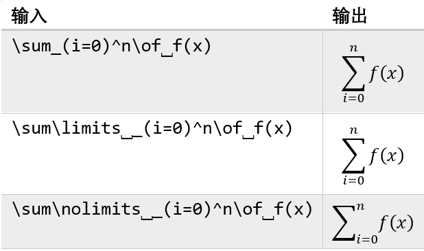
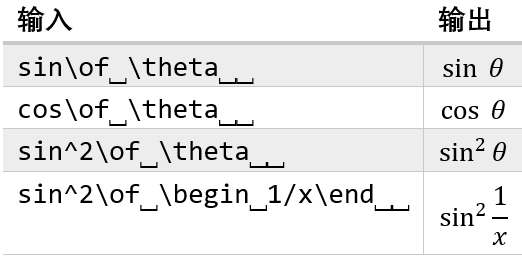

# 结构

本章将讲解如何输入公式的结构。另外要注意小括号等定界符的使用。

## 分式

在LaTeX中，分式往往是用控制词`\frac{}{}`来输入。第一个花括号里输入分子，第二个里输入分母。例如，$\frac{1}{2}$为`\frac{1}{2}`，$1\frac{2}{3}$为`1\frac{2}{23}`，$\frac{1}{x+1}$为`\frac{1}{x+1}`。

对于UnicodeMath则要简单不少，只需要`/`就可以。对于第三个例子这种分子分母是组合操作数的情况，则用小括号包含加以区分。注意，在这里输入的小括号只是作为定界符，在公式生成后就会消失。

所以，上面的例子可以用以下方式获得。

输入|输出
---|---
`1/2`|$\frac{1}{2}$
`1⎵2/3`|$1\frac{2}{3}$
`1/(x+1)⎵`|$\frac{1}{x+1}$

有时候公式空间太狭窄，为了美观，需要分式使用“横放”的方式，像用$1/a$代替$\frac {1}{a}$。用UnicodeMath直接输入`/`还是会生成竖式分式，要使用`\/`作为分式符号才会让公式呈现“横放”的样式。

word里的分式部分还提供了小分式这种结构，但是没有对应的控制词，只能在“公式工具”选项卡里点击输入。

除了`/`之外，UnicodeMath还有竖式分式`\ndiv`、斜式分式`\sdiv`和横式分式`\ldiv`来适应不同的需求。

以官方文档里的公式为例，则有

输入|输出
---|---
`(a/(b+c))/(d/e+f)⎵`|$\frac{\frac{a}{b+c}}{\frac{d}{e}+f}$
`(a/(b+c))\ndiv⎵(d/e+f)⎵`|$\frac{\frac{a}{b+c}}{\frac{d}{e}+f}$
`(a/(b+c))\sdiv⎵(d/e+f)⎵`|$\frac{\frac{a}{b+c}}{\frac{d}{e}+f}$
`(a/(b+c))\ldiv⎵(d/e+f)⎵`|$\frac{\frac{a}{b+c}}{\frac{d}{e}+f}$

另外，还有二项式系数这样的分式形式，则用`\atop`（¦）来获得。

**注意**：线性格式第3版新增了`\choose`（⒞）来获得二项式系数，不用额外输入前后的小括号。但是在word 2019里无效，反而在OneNote（UWP最新版）里有效。

输入|输出
---|---
`(n\atop⎵k)⎵`|$\binom{n}{k}$
`n\choose⎵k⎵`|$\binom{n}{k}$

## 上下标

UnicodeMath中的下标和上标的和LaTeX的方式很相识，都是用`_`表示下标，`^`表示上标。和分式一样，对于组合操作数的上下标都是用小括号将其分隔。

上标和下标可以一起使用，也可以嵌套使用。嵌套使用时也要用小括号进行分隔。当上标和下标同时使用时，输入顺序无论谁先谁后都不影响公式的生成。

输入|输出
---|---
`10^n⎵`|$10^n$
`a_i⎵`|$a_i$
`a_i^2⎵`|$a_i^2$
`a^2_i⎵`|$a^2_i$
`2^(a_i)⎵`|$2^{a_i}$
`a^m a^n=a^(m+n)⎵`|$a^m a^n=a^{m+n}$

一阶导数符号$\prime$也是一种上标，我们可以用“'”，也可以用`\prime`输入。但是二阶导数和三阶导数则要用`\pprime`和`\ppprime`输入。

输入|输出
---|---
`f'`或`f\prime`|$f'$
`f\pprime`|$f''$
`f\ppprime`|$f'''$
`f\pppprime`|$f''''$

除了右边，还有在左边的上下标。使用方法都是`_`表示下标，`^`表示上标。对于只有下标或上标的形式，例如$_1 F_1$则要用`_1⎵F_1`或`(_1^)F_1`。不过在word 2019里，只有左边都有上下标的时候有效，建议在OneNote里使用。

输入|输出
---|---
`_c^b a⎵`|$^b_c a$
`_1⎵F_1⎵`或`(_1^)F_1⎵`|$_1 F_1$

另外，有一个问题需要注意一下。我们有时需要输入一些化学元素的同位素，例如碳14，即$^{14}\text{C}$。在线性格式里，应该是`^14 "C"`或`(^14_)"C"`（用双引号表示文本用正体显示，详见之后的章节），结果往往得到$^{14}\text{"}C"$。所以，要得到我们想要的结果，就要先输入`(^14_)`或`(_^14)`，加上空格，就会得到左角标和右边的一个用虚线框表示的占位符，选中占位符，再输入`"C"`，再按空格，才能得到我们想要的碳14符号。

对于大型运算符，上下标的显示则有不同。像在行间公式里，对于求和和乘积，上下标在符号的正上下方，而对于积分，则在符号的右上下方。我们可以自定义上下标的位置，详见之后的章节。

## 根式

平方根、立方根和四次方根可以直接用Unicode的根式字符√（`\sqrt`，`U+221A`）、∛（`\cbrt`，`U+221B`）和∜（`\qdrt`，`U+221C`）得到，例如

输入|输出
---|---
`\sqrt⎵2⎵`|$\sqrt{2}$
`\sqrt(abc)⎵`|$\sqrt{abc}$
`\cbrt(c+d)⎵`|$\sqrt[3]{c+d}$
`\qdrt(16)⎵`|$\sqrt[4]{16}$

对于其他开方次数的根式，我们可以使用`\sqrt(n&a)`得到$\sqrt[n]{a}$。除非是复合的根式，对于一些较简单的根式，可以不用加小括号。

输入|输出
---|---
`\sqrt(n+1&a+b)⎵`|$\sqrt[n+1]{a+b}$
`\sqrt((m+1)/n)&(a+b)/c)⎵`|$\sqrt[\frac{m+1}{n}]{\frac{a+b}{c}}$

在线性格式第3版中，新增了`\root`这种类似LaTeX的根式输入方式。

输入|输出
---|---
`\root⎵\of⎵16⎵`|$\sqrt{16}$
`\root⎵n\of⎵a⎵`|$\sqrt[n]{a}$
`\root⎵n+1\of⎵(b+c)⎵`|$\sqrt[n+1]{b+c}$

## 大型运算符

点开“大型运算符”，可以看到求和（`\sum`）、乘积（`\prod`）和副积（`\amalg`）等大型运算符的共同点：不论它们有没有上下限，在它们的正右边，都一个参数——naryand。

而在UnicodeMath中，`\naryand`（▒，`U+2592`）就是用来输入naryand。不同于分式，naryand最外边的小括号不会在公式生成时自动消失，因为小括号的作用是用来分隔组合的naryand。如果我们不想用括号来分隔组合的naryand，可以使用控制词`\begin`（〖，`U+3016`）和`\end`（〗，`U+3017`）来作为定界符，这些字符在公式生成时就会消失。

在上一节里，可以看到我们使用控制词`\root`输入根式时，还要配合`\of`这个控制词。而在大型运算符中为了方便输入，也可以使用`\of`（▒，`U+2592`）代替`\naryand`。两个控制词是等同的。甚至`\naryand`也可以配合`\root`用于输入根式。

输入|输出
---|---
`\sum_(i=0)^n\of⎵1/(i+1)`|$\sum\limits_{i=0}^n \frac{1}{i+1}$
`\prod_(k=1)^n\of⎵A_k`|$\prod\limits_{k=1}^n A_k$
`\amalg_(i=0)^n\of⎵f(n)`或`\coprod_(i=0)^n\of⎵f(n)`|$\coprod\limits_{i=0}^n f(n)$
`\bigcap_(i=0)^n\of⎵f(n)`|$\bigcap\limits_{i=0}^n f(n)$
`\bigcup_(i=0)^n\of⎵f(n)`|$\bigcup\limits_{i=0}^n f(n)$
`\bigvee_(i=0)^n\of⎵f(n)`|$\bigvee\limits_{i=0}^n f(n)$
`\bigwedge_(i=0)^n\of⎵f(n)`|$\bigwedge\limits_{i=0}^n f(n)$

在使用中，可以注意到大型运算符在行内公式和行间公式的排版效果是有区别的。在行间公式里，没有空间的限制，大型运算符的上下标是在符号的正上下方的；而在行内公式里，为了避免过于拥挤或产生难看的行距，大型运算符的上下标都变成了在右边的角标。

我们可以使用类似LaTeX中的控制词`\limits`和`\nolimits`来准确控制巨算符的上下标位置。

输入|输出
---|---
`\sum_(i=0)^n\of⎵f(x)`|$\sum_{i=0}^n f(x)$
`\sum\limits⎵_(i=0)^n\of⎵f(x)`|$\sum\limits_{i=0}^n f(x)$
`\sum\nolimits⎵_(i=0)^n\of⎵f(x)`|$\sum\nolimits_{i=0}^n f(x)$

## 括号

括号（或者说定界符）有个概念，就是开符号和闭符号，也可以说左边的是开符号，右边的是闭符号。定界符可以是括号这样可见的，也可以是只表示边界但不显示的，例如`\begin`和`\end`（或者`\left`和`\right`）。

几种常见的括号（`()`、`[]`和`{}`）我们可以直接输入，除了小括号以外的其他括号，我们也可以用控制词输入。

输入|输出
---|---
`(a)⎵`|$\left(a\right)$
`[a]`或`\lbrack⎵a\rbrack⎵⎵`|$\left[a\right]$
`{a}`或`\lbrace⎵a\rbrace⎵⎵`|$\left\{a\right\}$
`\langle⎵a\rangle⎵⎵`或`\bra⎵a\ket⎵⎵`|$\left\langle a\right\rangle$
`\langle⎵\psi\vert⎵⎵`或`\bra⎵psi\|⎵`|$\langle\psi\vert$
`\vert⎵\psi\rangle⎵`或`\|\psi\ket⎵⎵`|$\vert\psi\rangle$
`\lfoor⎵a\rfloor⎵⎵`|$\left\lfloor a\right\rfloor$
`\lceil⎵a\rceil⎵⎵`|$\left\lceil a\right\rceil$
`\|a\|`或`\vert⎵a\vert⎵⎵`|$\vert a\vert$
`\norm⎵a\norm⎵⎵`或`\Vert⎵a\Vert⎵⎵`|$\left\Vert a\right\Vert$
`\lbbrack⎵a\rbbrack⎵⎵`|$\lbrack\lbrack a\rbrack\rbrack$
`\lambda\in\open\lbrack⎵1/2,\infty\close)⎵`|$\lambda\in\left\lbrack \frac{1}{2}, \infty\right)$

上面的例子有几点要了解：

1. 左矢、右矢的符号，也是尖括号可以用`\bra`和`\ket`，也可以用`\langle`和`\rangle`输入；
2. 方括号可以用`[]`，也可以用`\lbrack`和`\rbrack`输入；
3. 花括号可以用`{}`，也可以用`\lbrace`和`\rbrack`输入；
4. 绝对值定界符可以用竖线`|`（Shift+\），也可以用`\vert`输入；
5. 在输入完右括号之后，再按空格，可以让括号大小随内容调整；
6. 在左右括号前，用`\left`和`\right`，或者`\open`和`\close`也可以让括号的大小随包含内容调整；
7. 左右的括号可以不同，但是左右要对应；

有时候我们需要输入的括号是如下情况：

1. 两个单边的括号，例如`[[`和`]]`；
2. 倒置括号，例如`][`；
3. 只有单边的括号有显示，另一边有边界但不显示，例如$\left.\frac{\partial\, f(t)}{\partial\, t}\right\vert_{t=0}$；

我们不能直接输入，不然括号的大小自动调整会失效。这时候我们就要用到上面的`\left`和`\right`，即`\open`和`\close`控制词。

输入|输出
---|---
`\lbrack⎵a/b\close\rbrack⎵⎵`|$\left\lbrack\frac{a}{b}\right\lbrack$
`\open\rbrack⎵a/b\rbrack⎵⎵`|$\left\rbrack\frac{a}{b}\right\rbrack$
`\open\rbrack⎵a/b\close\lbrack⎵⎵`|$\left\rbrack\frac{a}{b}\right\lbrack$
`\open⎵\partial⎵f(t)/\partial⎵t\close\vert_(t=0)`|$\left.\frac{\partial\, f(t)}{\partial\, t}\right\vert_{t=0}$

有时候要在括号内使用分隔符，我们可以使用竖线`|`，不过为了避免和绝对值混淆，推荐使用`\vbar`。此外，对于$\{x \, |\, f(x)=0\}$这样的表达式则要用到`\mid`。

输入|输出
---|---
`(a\vbar⎵b\vbar⎵c)⎵`|$\left(a\vert b\vert c\right)$
`\lbrace⎵x\mid⎵f(x)=0\rbrace⎵`|$\left\lbrace x\, \|\, f(x)=0\right\rbrace$

如果我们对自动调节的定界符的大小不满意的话，我们还可以像LaTeX一样手动调节，只需要├（`\left`或`\open`）后面跟着“0”到“4”就可以，其和LaTeX的控制词的对应如下

数字|含义
---|---
0|不变
1|`\big`
2|`\Big`
3|`\bigg`
4|`\Bigg`

实例如下

$$
\Bigg\{
    \bigg\{
        \Big[
            \big(
            (x)
            \big)
        \Big]
    \bigg\}
\Bigg\}
$$

上述公式的输入文本为`\open⎵4{\open⎵3{\open⎵2[\open⎵1(\open⎵0(x))]}}⎵`。

事例和堆栈也被归类到括号这个大类中。

事例其实可以看做是缺少另一边的括号组，缺少的一边用对应的`\open`或`\close`（`\left`或`\right`）代替。其中事例组用控制词`\eqarray`或`\cases`引导，使用`()`将事例组包含起来，用`@`分段。若要对齐就要使用`&`。

而堆栈一般用在二项式系数，在分式一节已经讲解过。

输入|输出
---|---
`f(x)={\eqarray(-&x,⎵⎵x<0@&x,  x>=0)\close⎵⎵`|$f(x)=\begin{cases}-&x,\qquad x<0 \\ &x, \qquad x\geq 0\end{cases}$
`\open⎵\cases(S\subseteq⎵T@S\supseteq⎵T)}\LongrightarrowS=T`|$\left .\begin{gathered}S \subseteq T\\S \supseteq T\end{gathered}\right\}\implies S = T$
`{\cases⎵(x+y&=10@2x+y&=16)\close⎵⎵`|$\begin{cases}x+y&=10\\2x+y&=16\end{cases}$
`\cases(a=&1+2+3@+&4+5@+&6)⎵`|$\begin{gathered}a=&1+2+3\\+&4+5\\+&6\end{gathered}$
`(n\atop⎵k)⎵`|$\dbinom{n}{k}$

## 函数

像$\sin$这样的函数在公式里是以正体的样式显示的。使用UnicodeMath输入函数，可以直接使用`sin`，这样输入会被自动识别为函数且以正体显示。能被这样对待的函数可在“公式选项”的**可识别的函数**里查看，我们也能在里面添加自定义的函数。而在支持较新的UnicodeMath的软件里，例如在OneNote里，可以像LaTeX那用使用`\sin`的形式。

在输入函数名之后，我们可以有两种操作方式来输入函数的参数。

如果函数名之后有上下标，在输入上下标之后，可以按下空格，就会出现代表函数参数的占位符，之后继续输入。

另一种方法也是在函数之后（如果有上下标就在上下标之后）输入控制词`\funcapply`。`\funcapply`和大型运算符的控制词`\naryand`类似，都是引导之后的参数，也都可以使用`\of`代替。如果函数的参数是组合操作数，则也可以使用`\begin`和`\end`分隔参数。

输入|输出
---|---
`sin\of⎵\theta⎵`|$\sin\theta$
`cos\of⎵\theta⎵`|$\cos\theta$
`sin^2\of⎵\theta⎵`|$\sin^2\theta$
`sin^2\of⎵\begin⎵1/x\end⎵⎵`|$\sin^2\cfrac{1}{x}$

一些中间有空格的函数，例如$\limsup$直接使用`\limsup`即可获得。

## 积分和微分

积分运算符其实也是大型运算符，所以也有大型运算符的特性，也有自己不同的特性：

1. 有参数naryand，也用`\naryand`或`\of`引导；
2. 对于参数naryand，如果参数复杂需要定界符，用`()`则括号在公式生成后不会消失，可用`\begin`和`\end`（或者`\left`和`\right`）来分隔；
3. 默认情况下，不论是在行内还是行间，积分运算符的上下标都在积分符号的右角标处；
4. 可以使用`\limits`和`\nolimits`对上下标的位置进行自定义；

输入|输出
---|---
`\int_0^1\of⎵f(x)\dd⎵x⎵`|$\int_0^1 f(x)\, dx$
`\int\limits⎵_0^1\of⎵f(x)\dd⎵x⎵`|$\int\limits_0^1 f(x)\,dx$
`\int\nolimits⎵_0^1\of⎵f(x)\dd⎵x⎵`|$\int\nolimits_0^1 f(x)\,dx$
`\int_0^1\of⎵x^3+x^2⎵\dd⎵x`或`\int_0^1\of⎵\begin⎵x^3+x^2\end⎵\dd⎵x⎵`|$\int_0^1 x^3+x^2\, dx$

其他的积分符号有

输入|输出|输入|输出
---|---|---|---
`\iint`|$\iint$|`\iiint`|$\iiint$
`\iiiint`|$\iiiint$|`\oint`|$\oint$
`\oiint`|$\oiint$|`\oiiint`|$\oiiint$
`\aoint`|$\oint$|`\coint`|$\oint$

对于微分符号$\mathrm{d}$，UnicodeMath使用`\dd`来输入。虽然生成的微分符号看上去和在公式样式里的d没区别，但是会自动在前面产生间距。至于国标要求微分符号是正体，就只能手动调整了。

其他微分符号有：

1. 导数符号在上下标处已经讲解，用`\prime`、`\pprime`等；
2. 偏微分符号使用`\partial`；
3. 增量虽然可以使用希腊字母Δ，但是建议使用`\inc`；

输入|输出
---|---
`f\prime(x)`|$f'(x)$
`\inc⎵t`|$\Delta t$
`\dd⎵y/\dd⎵x⎵`|$\cfrac{dy}{dx}$
`\int\of⎵x\dd⎵x/(x^2+a^2)⎵⎵`|$\int \frac{d\, x}{x^2+a^2}$
`\open⎵\partial⎵f(t)/\partial⎵t\close\vert_(t=0)`|$\left.\cfrac{\partial\, f(t)}{\partial\, t}\right\vert_{t=0}$

## 标注符号

本节的内容不仅包括数学重音（math accent）符号，还有上下括号、带框公式和顶线底线等。

标注符号一类将数学重音和上下括号归为一类，其实二者的输入方式是不同的。

对于数学重音，要先输入要标注的原符号，接着再输入不同标注符号的控制词，而且标注符号还可以叠加。如果要标注的对象不止一个符号，则要用小括号包含起来。

输入|输出
---|---
`a\dot⎵⎵`|$\dot{a}$
`a\ddot⎵⎵`|$\ddot{a}$
`a\dddot⎵⎵`|$\ddot{a}$
`a\hat⎵⎵`|$\hat{a}$
`a\check⎵⎵`|$\check{a}$
`a\acute⎵⎵`|$\acute{a}$
`a\grave⎵⎵`|$\grave{a}$
`a\breve⎵⎵`|$\breve{a}$
`a\tilde⎵⎵`|$\tilde{a}$
`a\bar⎵⎵`|$\bar{a}$
`a\Bar⎵⎵`|$\bar{\bar{a}}$
`a\vec⎵⎵`|$\vec{a}$
`(ab)\vec⎵⎵`|$\vec{ab}$
`a\dot⎵⎵\hat⎵⎵`|$\hat{\dot{a}}$

对于上下是箭头的标注，要配合`\above`和`\below`才能生成。

输入|输出
---|---
`a\above⎵->⎵`或`a\above⎵\rightarrow⎵⎵`|$\overset{\rightarrow}{a}$
`a\above⎵\leftarrow⎵⎵`|$\overset{\leftarrow}{a}$
`a\above⎵\leftrightarrow⎵⎵`|$\overset{\leftrightarrow}{a}$
`a\above⎵\leftharpoonup⎵⎵`|$\overset{\leftharpoonup}{a}$
`a\above⎵\leftharpoondown⎵⎵`|$\overset{\leftharpoondown}{a}$
`a\below⎵\rightharpoondown⎵⎵`|$\underset{\rightharpoondown}{a}$

上下括号则使用和LaTeX类似的输入方式，如果要加上说明文本，则用上下标的形式输入。

输入|输出
---|---
`\overparen(x+\cdots+x)⎵`|$\overparen{x+\cdots+x}$
`\underparen(x+\cdots+x)⎵`|$\underparen{x+\cdots+x}$
`\overbrace(x+\cdots+x)⎵`|$\overbrace{x+\cdots+x}$
`\underbrace(x+\cdots+x)⎵`|$\underbrace{x+\cdots+x}$
`\overbrace(x+\cdots+x)^(n"个")⎵`|$\overbrace{x+\cdots+x}^{n\text{个}}$
`\underbrace(x+\cdots+x)_(n"个")⎵`|$\underbrace{x+\cdots+x}_{n\text{个}}$

要输入带框公式，则要用到字符`\rect`（▭，`U+25AD`），其用法和根式差不多，例如，`\rect⎵(E=mc^2)`可以让质能公式被一个矩形包围起来。

$$
\boxed{E=mc^2}
$$

我们还可以用数字来控制包围的样式，用法就是`\rect⎵(n&x)`，x表示要被包围的公式，数字n表示了不同的显示效果，代表的效果如下：

显示效果|数值
---|---
隐藏上边框|1
隐藏下边框|2
隐藏左边框|4
隐藏右边框|8
水平删除线|16
竖直删除线|32
左上至右下斜删除线|64
左下至右上斜删除线|128

不过，这个用法有问题，在word里几乎没效果，在OneNote里反而有效果，但是最后面的两项无论如何都无效，望知悉。

如果要添加顶线和底线，则要用`\overbar`（¯，`U+00AF`）和`\underbar`（▁，`U+2581`）。

输入|输出
---|---
`\overbar⎵a⎵`|$\overline{a}$
`\overbar⎵ab⎵`|$\overline{ab}$
`\underbar⎵(a\oplus⎵b)⎵`|$\underline{a\oplus b}$

## 极限和对数

极限和对数可以像函数一样直接输入。它们的下标使用`_`输入，参数使用`\funcapply`或`\of`引导。

函数$\limsup$和$\liminf$，有两点要说明。

- 虽然生成的函数有空格，但这是直接用`\limsup`和`\liminf`生成的；
- 这两个函数在word居然没效果，反而在OneNote里能生成相关公式。

输入|输出
---|---
`log_a\of⎵b⎵`|$\log_a⁡b$
`ln\of⎵b⎵`|$\ln⁡ b$
`lim_(n->\infty)\of⎵(1+1/n)^n⎵`|$\lim\limits_{n \to \infty}\left(1+\frac 1n \right)^n$
`max_(0<=x<=1)\of⎵x\ee⎵^(-x^2)⎵⎵`|$\max\limits_{0\le x \le 1} xe^{-x^2}$

## 运算符

本节的符号和标注符号有些不同。例如，同样是箭头和操作数的组合，标注符号一节是操作数为主体，而这一节的公式形式里，箭头是主体。同样是利用`\above`和`\below`，只是输入顺序不同。

输入|输出
---|---
`->\above⎵(a+b)⎵或\rightarrow\above⎵(a+b)⎵`|$\overset{a+b}{\rightarrow}$
`->\below⎵(a+b)⎵或\rightarrow\below⎵(a+b)⎵`|$\underset{a+b}{\rightarrow}$
`\leftarrow\above⎵(a+b)⎵`|$\overset{a+b}{\leftarrow}$
`\leftarrow\above⎵(a+b)⎵`|$\underset{a+b}{\leftarrow}$
`\leftrightarrow\below⎵(a+b)⎵`|$\overset{a+b}{\leftrightarrow}$
`\leftrightarrow\above⎵(a+b)⎵`|$\underset{a+b}{\leftrightarrow}$
`\Rightarrow\below⎵(a+b)⎵`|$\overset{a+b}{\Rightarrow}$
`\Rightarrow\above⎵(a+b)⎵`|$\underset{a+b}{\Rightarrow}$
`\Leftarrow\above⎵(a+b)⎵`|$\overset{a+b}{\Leftarrow}$
`\Leftarrow\above⎵(a+b)⎵`|$\underset{a+b}{\Leftarrow}$
`\Leftrightarrow\above⎵(a+b)⎵`|$\overset{a+b}{\Leftrightarrow}$
`\Leftrightarrow\above⎵(a+b)⎵`|$\underset{a+b}{\Leftrightarrow}$

这一类中还提供了一些数学运算符，包括≜、≝、≞，其中的≞在word 2019里需要添加`\meq`才能获得，但是在OneNote里就可以直接用`\meq`获得。

另有四个符号≔、==、+=和−=，可以配合`\box`输入。

输入|输出
---|---
`\box(:=)⎵`|$\coloneqq$
`\box(==)⎵`|$==$
`\box(+=)⎵`|$+=$
`\box(-=)⎵`|$-=$
`\defeq⎵`|$≝$
`\Deltaeq⎵`|$\triangleq$
`\meq⎵`|$≞$

## 矩阵

矩阵表达公式和LaTeX十分相似，格式如下

> ■ (exp1 [& exp2]… @ … expn-1 [& expn]… )

其中的字符■（`\matrix`，`U+25A0`）表示矩阵，&用来分隔每个列，@用来分隔每个行，空矩阵单位就不输入，最后一行/列不需要用字符分隔。例如，我们用`\matrix(a&b@c&d)`可以得到

$$
\begin{matrix}
a&b\\
c&d
\end{matrix}
$$

如果我们想要用括号包围矩阵，则只需要在`\matrix(a&b@c&d)`外输入括号即可。

输入|输出
---|---
`\matrix(a&b@c&d)⎵`|$\begin{matrix}a&b\\c&d\end{matrix}$
`[\matrix(a&b@c&d)]⎵`|$\left[\begin{matrix}a&b\\c&d\end{matrix}\right]$
`(\matrix(a&b@c&d))⎵`|$\left(\begin{matrix}a&b\\c&d\end{matrix}\right)$
`\|\matrix(a&b@c&d)\|⎵`|$\left\vert\begin{matrix}a&b\\c&d\end{matrix}\right\vert$
`{\matrix(a&b@c&d)}⎵`|$\left\{\begin{matrix}a&b\\c&d\end{matrix}\right\}$
`\norm\matrix(a&b@c&d)\norm⎵⎵`|$\left\Vert\begin{matrix}a&b\\c&d\end{matrix}\right\Vert$

对于这么常用的功能，线性格式第3版也借用了LaTeX的矩阵输入方式，引入了诸如`\bmatrix`、`\pmatrix`和`\Bmatrix`等控制词。

输入|输出
---|---
`\matrix(a&b@c&d)⎵`|$\begin{matrix}a&b\\c&d\end{matrix}$
`\bmatrix(a&b@c&d)⎵`|$\begin{bmatrix}a&b\\c&d\end{bmatrix}$
`\pmatrix(a&b@c&d)⎵`|$\begin{pmatrix}a&b\\c&d\end{pmatrix}$
`\vmatrix(a&b@c&d)⎵`|$\begin{vmatrix}a&b\\c&d\end{vmatrix}$
`\Bmatrix(a&b@c&d)⎵`|$\begin{Bmatrix}a&b\\c&d\end{Bmatrix}$
`\Vmatrix(a&b@c&d)⎵`|$\begin{Vmatrix}a&b\\c&d\end{Vmatrix}$

不过，word可能没有录入相关的控制词，所以我们要自己添加。

- `\matrix`（■，`U+25A0`，…）
- `\bmatrix`（ⓢ，`U+24E2`，\[…\]）
- `\pmatrix`（⒨，`U+24A8`，(…)）
- `\vmatrix`（⒱，`U+24B1`，|…|）
- `\Bmatrix`（Ⓢ，`U+24C8`，{…}）
- `\Vmatrix`（⒩，`U+24A9`，‖…‖）

如果矩阵要用到的省略号的关键词有中线省略号`\cdots`、基线省略号`\ldots`、垂直省略号`\vdots`和对角省略号`\ddots`。
