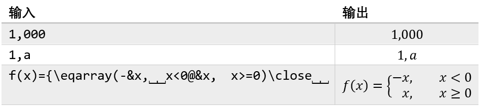

# 额外内容

**注**：部分特性在word 2019里不可用，但是在OneNote中可用。请按照实际情况使用。

## 定界符

例如公式中分式和上下标等结构使用“`()`”作为定界符，在公式生成之后，括号会随之消失。我们也可以使用不会显示的定界符，`\open`和`\close`（`\left`和`\right`）来达到同样的目的。

## 对齐和手动分隔

虽然在事例公式中有“`&`”用来对齐，其实word自带了公式对齐功能，只是有些简单。

我们以公式$x=a+b+c=d+e=f$以等号对齐为例。首先输入公式，然后再第二和第三个等号前插入软回车（Shift+Enter），得到

然后在三个等号前都在右键快捷菜单里选择“在此字符处对齐”。

最后可得如下结果。

对于一些简单的多行公式，word也可以进行对齐。

输入如下公式

然后选中所有公式，并且在右键快捷菜单里选择“对齐（A）=”。

最后公式会自动以等号对齐。

word也为公式提供了手动分隔的功能，直接在右键快捷菜单里选择“插入手动分隔符（M）”，就可以在当前位置换行。不过这个功能不能和软回车等同，因为选择插入手动分隔符之后就没有了对齐的功能。

## 文本运算符

在UnicodeMath中，许多符号承担了相应的功能。不过有时候我们需要它们以普通字符的形式出现在公式中，如果我们直接输入，系统会将它们当成功能符号，最后会得到期望外的公式。所以我们使用字符“`\`”来让这些功能符号称为普通的符号。

输入|输出
---|---
`a\_b`|$a\_b$
`a\/b`|$a/b$

## 普通文本

有时候我们想要在数学公式中输入正体显示的普通文本，如果直接输入，往往会显示为斜体。UnicodeMath提供了用双引号的方式来满足需求。

输入|输出
---|---
`"text"⎵`|$\text{text}$
`->\above⎵"yields"⎵⎵`|$\underrightarrow{\text{yields}}$

## 微分、自然常数和虚数符号

在国标中，微分、自然常数和虚数符号都是以正体显示。但是UnicodeMath用的是美国标准，所以显示的是斜体。

输入|输出
---|---
`\Dd⎵`|$D$
`\dd⎵`|$d$
`\ee⎵`|$e$
`\ii⎵`|$i$
`\jj⎵`|$j$

虽然其中的微分符号和直接输入的字母看上去一样，其实这样输入的微分符号会自动和前面的符号产生一定的间距。

输入|输出
---|---
`xdx`|$xdx$
`x\dd⎵x`|$x\,dx$

## 公式编号

UnicodeMath也提供了为公式编号的功能，只需要在行间公式后输入“#(编号)”，在按下回车键就可以。例如，输入`y=x^2+x+1#(1)<Enter>`就可以得到编号为1的公式了。

$$
\begin{equation}
y=x^2+x+1
\end{equation}
$$

不过这个功能的作用有限。这个功能显示的编号是自己输入的那个，不会自动编号。而且也无法被文章交叉引用。word提供了多种内容的自动编号和交叉引用功能，像表格和图片等等。但是对于公式，相关的功能就一直缺席。UnicodeMath提供的公式编号功能也无法满足这方面的需求。

## 逗号、句号和冒号

UnicodeMath中的逗号、句号和冒号对空格很敏感，可以配合空格达成某些功能。

**逗号**：

1. 如果逗号被数字包围，逗号就会有普通文本的间距；
2. 如果没有上述情况，不论逗号之后有没有空格，逗号都会被当成标点符号，而且逗号之后都会自动加上一个小空格；
3. 如果逗号之后跟着两个空格，逗号就会被当成从句分隔符，逗号之后会跟上一串空格。

输入|输出
---|---
`1,000`|$1,000$
`1,a`|$1,\,a$
`f(x)={\eqarray(-&x,⎵⎵x<0@&x,⎵⎵x>=0)\close⎵⎵`|$f(x)=\begin{cases}-&x,\quad x<0\\&x,\quad x\geq 0\end{cases}$

**句号**：

1. 如果句号被数字包围，逗号就会有普通文本的间距；
2. 如果没有上述情况，不论句号之后有没有空格，句号都会被当成标点符号，而且句号之后都会自动加上一个小空格；
3. 在句号后面加两个空格不会起将句号当从句分隔符的作用；
4. 有一种情况是将小数点前的0省略，例如$.5$。对此，如果句号之后跟着一个数字，并且
    1. 它是在公式区的起始处；
    2. 它跟在一个已建立的数学对象的起始或参数末尾符号的后面；
    3. 它跟在任何运算符之后（除了闭符号和标点符号）

    那么，这个句号就会被当成小数点。例如，`a/.3`会显示为$\frac{a}{.3}$。

输入|输出
---|---
`3.14`|$3.14$
`3.a`|$3.\,a$
`.⎵⎵a`|$.\,\,a$
`a/.3`|$\frac{a}{.3}$

**冒号**：

1. 如果冒号前面加上空格，那么冒号就会被当成比例符号（`U+2236`），而且带有相应的间距；
2. 如果前面不加空格，那么冒号就是标点符号，只有标点符号的间距。

输入|输出
---|---
`1⎵:1`|$1:1$
`1:1`|$1\colon 1$

## 空格字符

Unicode有许多带有宽度和属性的空格字符，在数学公式中就用这些空格字符来微调公式的间距。不像ASCII的空格会在公式生成后消失，这些空格是不会消失的。

不同空格字符的效果如下。

间隔|名称|输入|输出
---|---|---|---
0 em|zero-width space|`\zwsp`|$xy$
1/18 em|veryverythinmathspace|`\hairsp`|$xy$
2/18 em|verythinmathspace||
3/18 em|thinmathspace|`\thinsp`|$xy$
4/18 em|mediummathspace|`\medsp`|$xy$
5/18 em|thickmathspace|`\thicksp`|$xy$
6/18 em|verythickmathspace|`\vthicksp`|$xy$
7/18 em|veryverythickmathspace||
9/18 em|ensp|`\ensp`|$xy$
18/18 em|emsp|`\emsp`|$xy$
digit width|numsp|`\numsp`|$xy$
space width|no-break space|`\nbsp`|$xy$

## 幻影和粉碎

幻影（phantom）和粉碎（smash）是从LaTeX中引入的功能。

幻影的控制词`\phantom`后带有一个参数，能产生一个和参数一样大小的空间，空间会占据位置，而参数内容不会显现，就和幻影一样。另外还有`\hphantom`和`\vphantom`，分别在水平方向和竖直方向生成幻影（在另一个方向则不会生成）。

命令|效果|输入|输出
---|---|---|---
`\phantom`|幻影保持高度和宽度|`sin\of⎵\phantom(1+1/a)⎵x`|$\sin⁡\phantom{1+\frac{1}{a}} x$
`\hphantom`|幻影高度消失|`sin\of⎵\hphantom(1+1/a)⎵x`|$\sin⁡\hphantom{1+\frac{1}{a}} x$
`\vphantom`|幻影宽度消失|`sin\of⎵\vphantom(1+1/a)⎵x`|$\sin⁡\vphantom{1+\frac{1}{a}} x$

幻影还可以使用`\phantom(n&<操作数>)`的方式来自定义幻影的形式，其中n为相关属性的代表数的和。

参数|效果|输入|输出
---|---|---|---
1|幻影显示|`sin\of⎵\phantom(1&1+1/a)⎵x`|sin⁡⟡(1&1+1/a)  1/x
2|幻影宽度为0|`sin\of⎵\phantom(2&1+1/a)⎵x`|sin⁡⟡(2&1+1/a) x
4|幻影上部高度为0|`sin\of⎵\phantom(4&1+1/a)⎵x`|sin⁡⟡(4&1+1/a) x
8|幻影下部高度为0|`sin\of⎵\phantom(8&1+1/a)⎵x`|sin⁡⟡(8&1+1/a) x
16|幻影为透明|`sin\of⎵\phantom(16&1+1/a)⎵x`|sin⁡⟡(16&1+1/a) x

粉碎的控制词`\smash`则和`\vphantom`相反，后方的参数内容会显示，然后让参数内容失去高度和宽度。此外，粉碎还有`\asmash`、`\dsmash`和`\hsmash`三个控制词。

命令|效果|输入|输出
---|---|---|---
\smash|上下部高度消失|`sin\of⎵\smash(1+1/a)⎵x`|sin⁡⬍(1+1/a) x
\asmash|上部高度消失|`sin\of⎵\asmash(1+1/a)⎵x`|sin⁡⬆(1+1/a) x
\dsmash|下部高度消失|`sin\of⎵\dsmash(1+1/a)⎵x`|sin⁡⬇(1+1/a) x
\hsmash|宽度消失|`\int_0^(\hsmash(2π⎵))\of⎵x\dd⎵x⎵`|∫_0^⬌2π▒xⅆx

